# AI Code Reviewer · AI 代码评审平台

[中文](README.md) | [English](README_EN.md)

> 开箱即用的 Java 代码质量评审平台：本地静态分析引擎 + 可选 AI 语义评审 + SonarQube 式五级评分与质量门禁。
> 单个 JAR / 单个 Docker 镜像交付，内嵌数据库零外部依赖，完全离线可用，界面、规则、报告原生中文。

---

## 📖 项目背景

中小团队做代码质量管控，市面上常见的方案都有明显的痛点：

- **SonarQube 等平台太重**：需要独立的服务器、数据库和多个后台组件，社区版规则与功能受限，高级能力（分支分析、PDF 报告、部分安全规则）要商业授权，中文支持差；
- **PMD / SpotBugs / Checkstyle 只是"问题清单"**：命令行或 IDE 插件形态，没有评分体系、没有质量门禁、没有可视化报告、没有团队协作的忽略/治理机制，非技术角色看不懂；
- **AI 编码助手各自为战**：每个工具单独配 API，无法统一管理多家大模型，也不会和静态分析结果打通；
- **国内环境有额外诉求**：内网物理隔离、信创数据库（达梦/人大金仓/openGauss）、国产大模型、中文汇报材料。

因此打造了这个**一体化代码评审平台**：一个 JAR 或一个容器就能跑起来，内嵌 H2 数据库开箱即用；19 个检查器覆盖安全、缺陷、风格、架构、并发、依赖六大质量域；联网时可选接入多家大模型做 AI 深度评审；评分、门禁、技术债、报告全流程中文化。

## ✨ 项目介绍

### 核心功能

**1. 多种代码接入方式**
- 上传 ZIP 压缩包、直接粘贴代码片段；CI 场景下自动 Git 克隆（GitHub / GitLab / Gitee / 自建平台，支持私有仓库凭据）
- 自动环境检测：JDK 版本、构建工具、框架、依赖树、根包结构；可选执行单元测试
- 代码快照留存，问题可回溯到源码上下文（带行号与问题行高亮）

**2. 本地静态分析引擎（完全离线，19 个内置检查器）**

| 质量域 | 覆盖内容 |
|--------|----------|
| 缺陷 | 编译诊断、空指针风险、资源泄露、异常处理（空 catch 等） |
| 安全（SAST） | SQL 注入、命令注入、不安全反序列化、硬编码密钥、弱加密、弱随机数、XXE、SSRF、路径穿越 |
| 架构约束 | 控制器跨层直连 DAO、下层反向依赖上层、实体泄漏到接口层 |
| 并发 | 单例共享可变状态、静态 SimpleDateFormat、双重检查锁缺 volatile |
| 风格 / 冗余 | 命名规范、魔法数字、通配符导入、超长行、TODO 注释、未使用方法、重复代码块（CPD 式 Token 指纹，自动排除 getter/setter 与构造方法等样板，误报少） |
| 依赖漏洞 | 解析 pom.xml / build.gradle，与内置 CVE 漏洞库比对（可选 OSV 在线增强） |
| 质量 / 性能 / 框架 | 圈复杂度、方法/文件长度、性能问题、Spring 最佳实践 |

**3. AI 深度评审（可选，不配 AI 也能完整使用）**
- 多厂商大模型接入：OpenAI 兼容协议与 Anthropic 协议双通道，内置 12 个厂商模板（阿里百炼、火山方舟、DeepSeek、Kimi、智谱、百度千帆、Gemini、Claude、Ollama / vLLM / LocalAI 本地私有部署等），API Key AES 加密存储
- 单条问题「AI 增强建议」：问题分析 / 修复方案 / 修复代码三段式，严格限定在问题行范围内
- 一键「AI 深度评审」批量补齐全部未增强问题，进度实时可视

**4. 五级评分与质量门禁（对标 SonarQube）**
- 五级严重度：阻断 BLOCKER（-25）/ 严重 CRITICAL（-15）/ 主要 MAJOR（-5）/ 次要 MINOR（-1）/ 提示 INFO（0 分仅展示）
- 评分 = 100 − Σ(数量 × 扣分)，评级 优秀 / 良好 / 一般 / 较差
- 门禁 = 阻断清零（可配上限）+ 评分达线；**每级扣分值、通过线、评级分界均可在页面上自定义，保存即时生效，无需重启、无需重扫**
- 技术债估算：按规则目录折算修复分钟数

**5. 问题治理**
- 同文件同规则问题自动聚合为一条（多处位置合并展示），不刷屏
- 行级忽略 + 规则级忽略（按规则码 / 文件路径 / glob / 行号），忽略原因留痕
- 检查器与规则阈值均可在页面配置启停

**6. 报告与 CI/CD**
- HTML / PDF 报告一键导出，内嵌中文字体，含评分、门禁结论、分类统计、逐条问题与建议
- Webhook 触发扫描（GitHub / GitLab / Gitee / 通用），扫描完成自动回写 commit status、MR/PR 评论（评分 + 门禁 + Top 问题），流水线按门禁结论阻断
- CI 访问令牌管理、扫描记录追溯

**7. 认证与权限**
- JWT 本地账号 + 远端 OAuth2 单点登录（对接企业 OA），管理员 / 只读双角色
- 数据库密码、API Key、仓库令牌等敏感配置全部 AES 加密落库

**8. 界面与国际化**
- Thymeleaf 服务端渲染，无 Vue / npm / Node 构建链，零 CDN 全本地化资源（内网可用）
- 中英文双语切换、深色 / 浅色主题、响应式布局（PC / 平板 / 手机）

**9. 多数据库支持**

| 数据库 | 说明 |
|--------|------|
| H2（内嵌） | 默认，开箱即用，零安装 |
| MySQL / PostgreSQL / Oracle | 内置驱动 |
| 达梦 DM / 人大金仓 / openGauss | 信创场景，驱动随包内置 |
| 自定义 JDBC | 页面上传驱动 JAR 即可接入任意数据库 |

页面可视化切换数据库，自动建表 / 迁移，支持连通性测试。

### 技术栈

| 层次 | 技术选型 |
|------|----------|
| 后端框架 | Spring Boot 3.2.5 · Java 17（Web / AOP / Validation / Cache / Actuator） |
| 持久层 | MyBatis-Plus 3.5.5 · H2 2.2（内嵌默认）· MySQL / PostgreSQL / Oracle / 达梦 / 金仓 / openGauss 驱动 · 动态多数据源 |
| 静态分析 | JavaParser 3.25（AST + 符号求解）· ASM 9.6（字节码）· 自研 CPD 式重复代码指纹 |
| AI 接入 | Spring WebFlux HTTP 客户端 · OpenAI 兼容 / Anthropic 双协议适配层 |
| 报告 | OpenPDF 1.3（矢量中文 PDF）· Thymeleaf HTML 报告 |
| 版本控制 | JGit 6.8（仓库克隆） |
| 安全 | JWT · spring-security-crypto（BCrypt）· AES 配置加密 · OAuth2 远端认证 |
| 前端 | Thymeleaf SSR · 原生 JavaScript · CSS 变量设计令牌 · 内联 SVG 图标精灵 · 零 CDN |
| 部署 | 单 JAR · Docker 多阶段构建（内置中文字体、非 root 运行、HEALTHCHECK）· docker compose |

## 🖼️ 效果预览

以下截图均取自真实运行页面，图片资产位于仓库 [`images/`](images) 目录。

**仪表盘** — 任务统计、质量评分与技术债总览

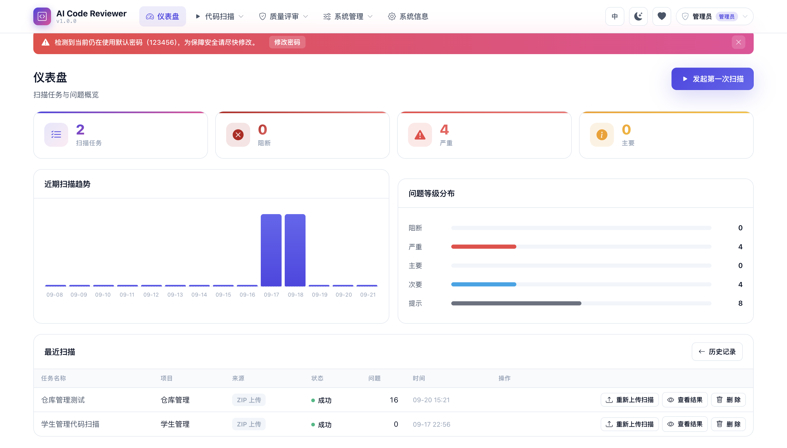

**代码扫描** — 发起 ZIP / Git / Webhook 扫描任务

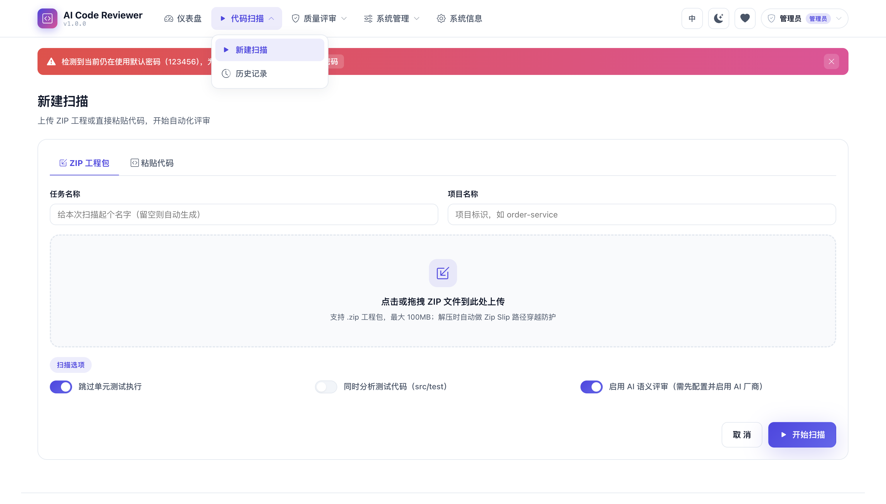

**扫描历史** — 任务列表与状态流转

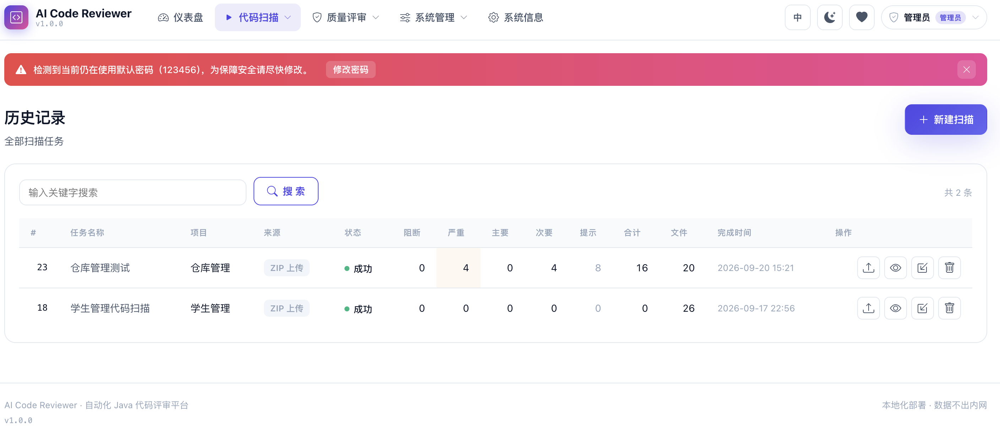

**扫描结果** — 五级问题统计与分类汇总

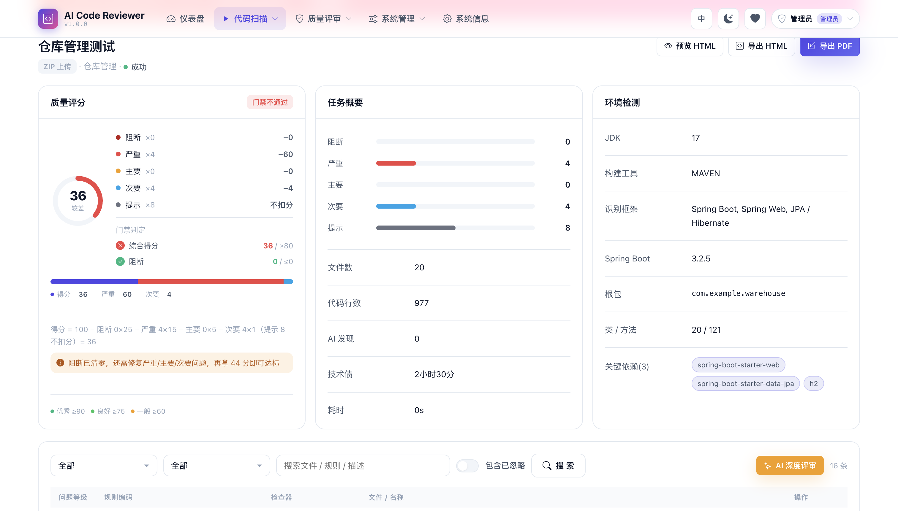

**结果详情** — 代码上下文、修复建议与 AI 增强建议

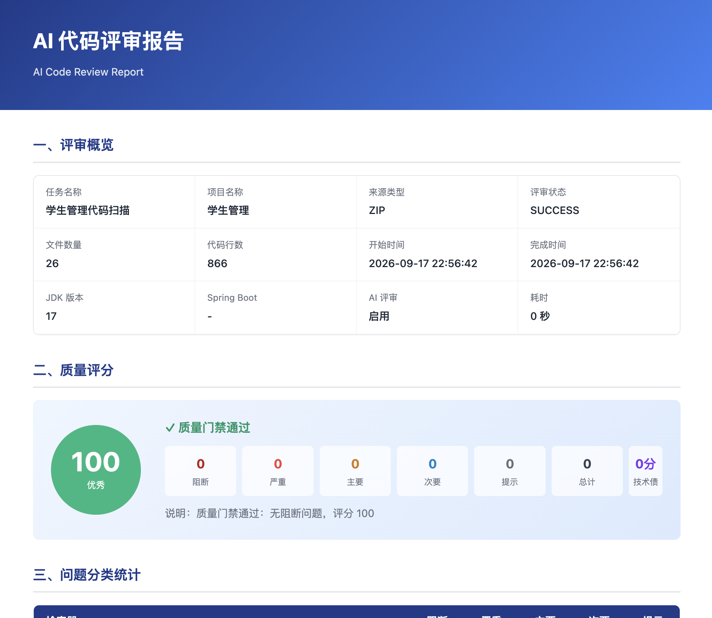

**AI 厂商配置** — 内置厂商模板与双协议接入

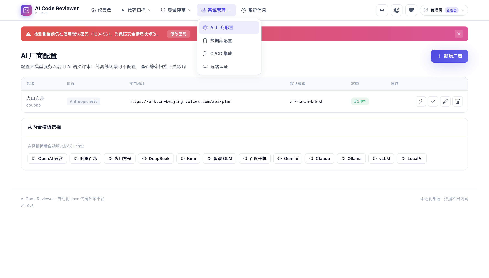

**检查器配置** — 检查器启停与参数调整

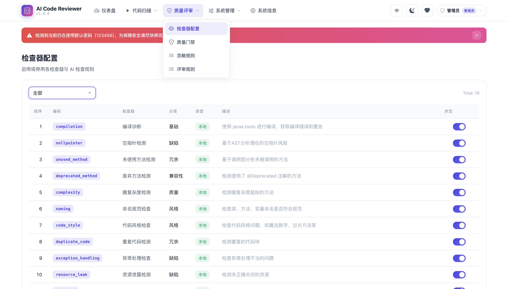

**评审规则** — 规则默认等级与维护

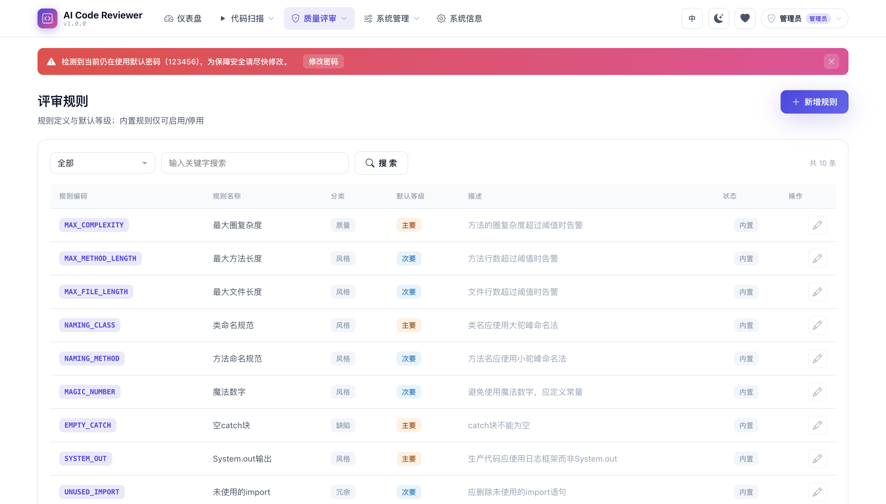

**质量门禁** — 阈值配置与门禁判定

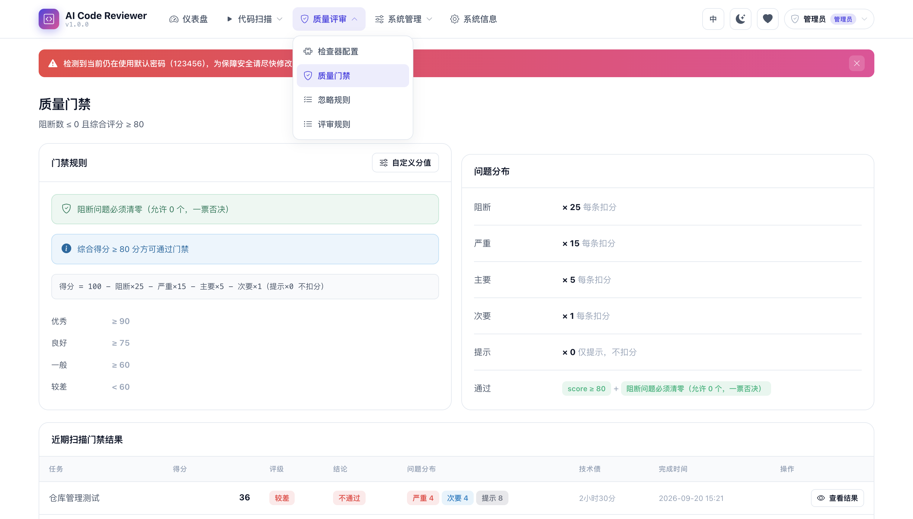

**忽略规则** — 路径与规则级忽略配置

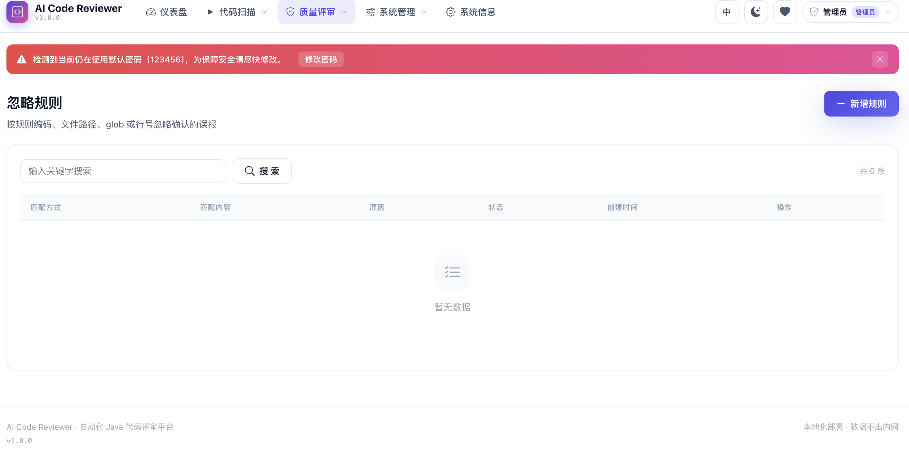

**数据库配置** — 内嵌元数据与动态外接数据源

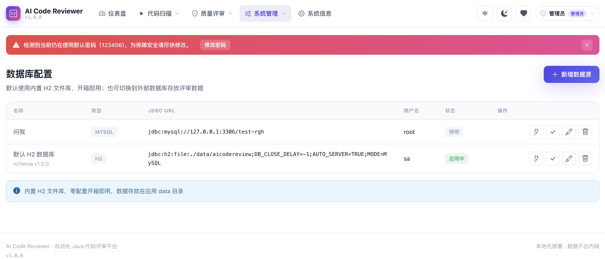

**CI/CD 集成** — 流水线接入配置

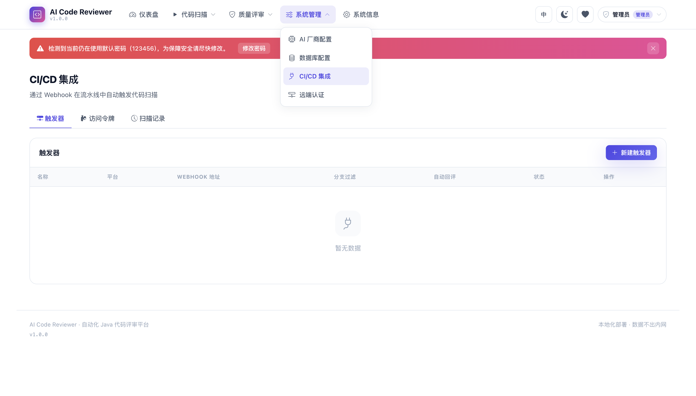

**远端认证** — 对接企业 OA / 统一登录

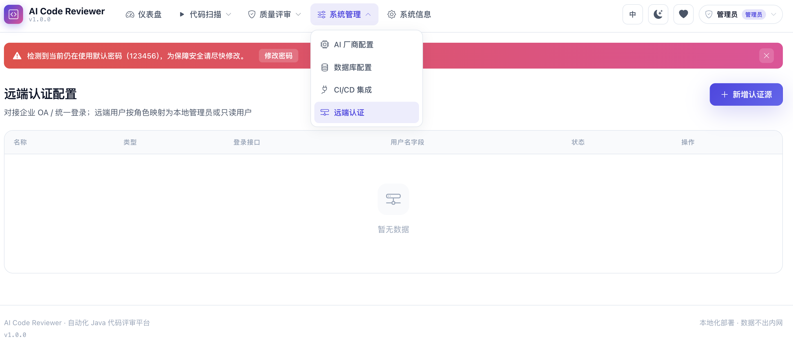

**英文界面** — 中 / 英双语切换

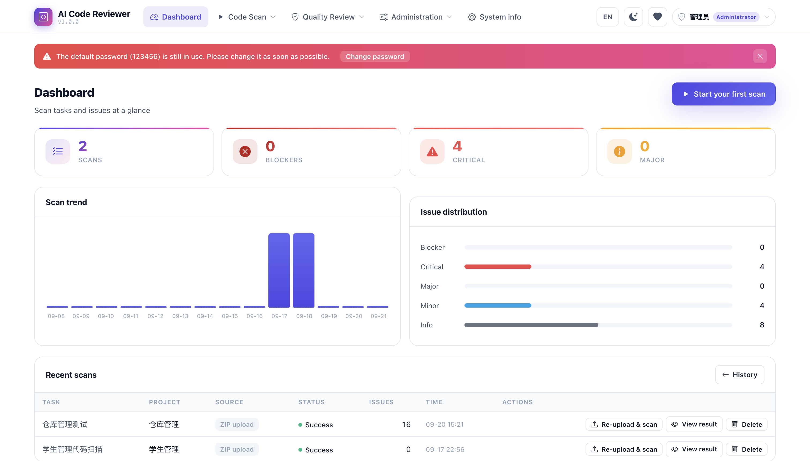

**暗色模式** — 深色主题切换

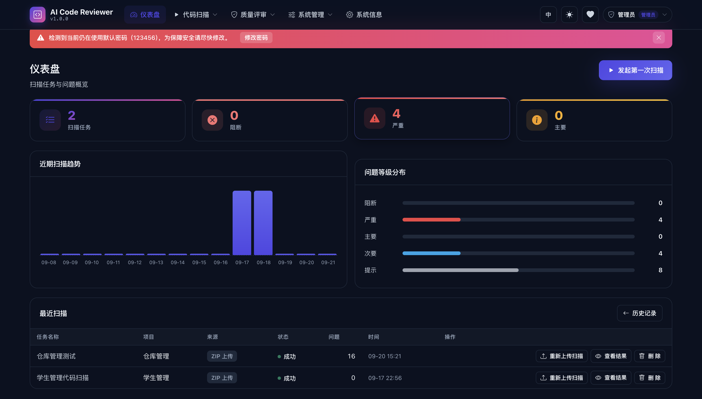

## ⚔️ 优势对比

与市面常用工具横向对比：

| 维度 | **AI Code Reviewer** | SonarQube（社区版） | PMD / SpotBugs / Checkstyle | CodeQL |
|------|----------------------|---------------------|------------------------------|--------|
| 部署复杂度 | ⭐ 单 JAR / 单容器，内嵌数据库，1 分钟起服务 | 服务器 + 数据库 + 计算引擎，通常需要专人运维 | 轻量，但只有 CLI / IDE 插件，无服务端与页面 | 需编译 codebase + 专用 CLI，服务端仅 GitHub |
| 中文支持 | ✅ 界面 / 规则 / 建议 / 报告原生中文 | ❌ 以英文为主 | ❌ | ❌ |
| AI 语义评审 | ✅ 多厂商大模型（含国产与本地 Ollama），问题级修复建议 | ❌（仅商业云服务提供） | ❌ | ❌ |
| 评分与质量门禁 | ✅ 五级评分，扣分值 / 阈值 / 评级分界页面自定义即时生效 | ✅ 规则固定，不可自定义分值 | ❌ 只有问题清单 | ❌ |
| 重复代码检测 | ✅ CPD 式 Token 指纹，自动排除样板代码误报 | ✅（部分能力受限） | 需另配 CPD | ❌ |
| 依赖漏洞（CVE） | ✅ 内置漏洞库 + 可选 OSV 在线增强 | ❌（依赖商业版） | ❌ | ❌（需另配 Dependabot） |
| 架构分层检查 | ✅ 内置 | 部分（需插件 / 付费） | ❌ | 可自写查询，学习成本高 |
| CI/CD 集成 | ✅ Webhook 触发 + 状态回写 + MR/PR 评论（GitHub / GitLab / Gitee / 自建） | ✅ 需额外插件与配置 | 需自行编写脚本 | ✅ 仅限 GitHub 生态 |
| 可视化报告 | ✅ HTML / PDF 中文报告一键导出 | PDF 需插件 / 付费 | ❌ | ❌ |
| 离线 / 内网运行 | ✅ 全功能离线（AI 为可选增强） | ✅ | ✅ | ✅ |
| 信创数据库 | ✅ 达梦 / 人大金仓 / openGauss 驱动内置 | ❌ | — | — |
| 授权费用 | ✅ MIT 完全免费 | 社区版免费，高级功能付费 | 免费 | GitHub 私有仓库需付费 |
| 语言覆盖 | Java（深度聚焦） | 多语言 | Java 为主 | 多语言 |

**客观定位**：如果你需要多语言混合仓库的海量规则生态与长期趋势治理，SonarQube / CodeQL 更成熟。本项目的差异化价值在于——**零门槛部署、中文原生、AI 增强、Java 场景一站式**：不用装数据库、不用配运维、不用买授权，一条命令获得"扫描 → 评分 → 门禁 → 报告 → CI 阻断"完整闭环，特别适合中小 Java 团队、内网隔离环境、信创项目与教学演示。

## 🚀 部署方法

### 环境要求

| 部署方式 | 要求 |
|----------|------|
| JAR 运行 | JDK 17+（构建需 Maven 3.9+） |
| Docker | Docker 20.10+ / Docker Compose v2 |

### 方式一：JAR 部署

```bash
# 构建
mvn package -DskipTests

# 启动（工作目录下自动生成 data/ 数据库、work/ 快照与报告）
java -jar target/ai-code-reviewer.jar
```

访问 http://localhost:8080 ，默认账号（首次启动自动创建，**请立即修改密码**）：

| 账号 | 密码 | 角色 |
|------|------|------|
| admin | 123456 | 管理员（全部功能） |
| view | 123456 | 只读用户 |

开发模式：`mvn spring-boot:run`（模板已关闭缓存，改完刷新即可）。

### 方式二：Docker 部署（推荐）

**docker compose 一键起：**

```bash
# 可选：复制 .env.example 为 .env，修改 JWT 与 AES 密钥
docker compose up -d --build

docker compose ps          # 查看状态
docker compose logs -f     # 跟踪日志
```

**docker 命令方式：**

```bash
# 构建镜像（多阶段：Maven 打包 → JRE 运行时）
./scripts/docker-build.sh 1.0.0
# 国内网络环境可用镜像站加速构建：
./scripts/docker-build-cn.sh 1.0.0

# 运行（数据卷持久化）
docker run -d --name ai-code-reviewer \
  -p 8080:8080 \
  -v aicr-data:/app/data \
  -v aicr-work:/app/work \
  -v aicr-logs:/app/logs \
  -v aicr-lib:/app/lib \
  -e APP_JWT_SECRET="your-own-random-secret-at-least-32-chars" \
  -e APP_CRYPTO_KEY="your-16-char-key" \
  --restart unless-stopped \
  ai-code-reviewer:1.0.0
```

健康检查：`curl http://localhost:8080/actuator/health` → `{"status":"UP"}`

**镜像特性**：内置 Noto CJK / 文泉驿中文字体（PDF 报告中文正常）、非 root 用户运行、自带 HEALTHCHECK、优雅停机。

**主要环境变量：**

| 变量 | 默认值 | 说明 |
|------|--------|------|
| `SPRING_PROFILES_ACTIVE` | `prod` | 生产配置 |
| `APP_AUTH_ENABLED` | `true` | 是否开启登录鉴权 |
| `APP_JWT_SECRET` | 内置占位值 | JWT 签名密钥，**生产必须修改** |
| `APP_JWT_EXPIRE_HOURS` | `24` | Token 有效期（小时） |
| `APP_CRYPTO_KEY` | 内置占位值 | 敏感配置 AES 密钥（16 字符），**生产必须修改** |
| `APP_WORK_DIR` | `/app/work` | 代码快照 / 报告工作目录 |
| `APP_DRIVER_DIR` | `/app/lib/custom` | 自定义 JDBC 驱动目录 |
| `DATASOURCE_URL` | 容器内 H2 文件库 | 可覆盖为外部 MySQL / PostgreSQL 等 |
| `TZ` | `Asia/Shanghai` | 时区 |

数据持久化目录：`/app/data`（数据库）、`/app/work`（快照 / 报告）、`/app/logs`（日志）、`/app/lib`（驱动 JAR）。

### 快速上手

1. 登录后进入「新建扫描」，上传项目 ZIP 或直接粘贴代码；
2. 扫描完成自动跳转结果页：评分环、五级问题分布、门禁结论、逐条问题（可展开代码上下文）；
3. 「质量门禁」页查看全部任务的评分趋势与门禁结果，管理员可点「自定义分值」调整每级扣分与阈值；
4. 「报告导出」生成 HTML / PDF；
5. 需要 CI 联动时，在「CI/CD 集成」页创建触发器与令牌，流水线里 `curl` 推送 Webhook 即可自动扫描、回写状态与评论。

## 📁 项目结构

```
ai-code-reviewer/
├── src/main/java/com/aicodereview/
│   ├── checker/         # 检查器框架与 19 个内置检查器（AST / 正则 / 扫描级）
│   ├── config/          # 启动初始化、Bean 配置
│   ├── controller/      # 页面控制器 + REST API
│   ├── datasource/      # 动态多数据源与方言适配
│   ├── dto/ entity/ mapper/   # 数据模型（MyBatis-Plus）
│   ├── llm/             # 多厂商 LLM 协议适配层
│   ├── security/        # JWT、角色切面、用户上下文
│   ├── service/         # 扫描、评分门禁、AI 评审、报告、CI 回调等
│   └── util/            # 工具类
├── src/main/resources/
│   ├── db/              # H2 / MySQL 双方言 DDL
│   ├── i18n/            # 中英文消息包
│   ├── security/        # 内置 CVE 漏洞库
│   ├── templates/       # Thymeleaf 页面（16 个）
│   ├── static/          # CSS / JS / 本地图标（零 CDN）
│   └── application.yml
├── samples/             # 示例坏代码（可直接粘贴体验）
├── scripts/             # Docker 构建 / 运行脚本（含国内镜像站版）
├── Dockerfile           # 多阶段构建
└── docker-compose.yml
```

## 🤝 总结与反馈

这个项目从"让中小团队用最低成本获得完整代码质量闭环"出发，做到了：**一个容器交付、零外部依赖、离线可用、中文原生、AI 可选增强、评分门禁可自定义、CI 全链路联动**。它还在持续演进，规则库、漏洞库、报告形态都会不断扩充。

欢迎使用、欢迎 Star、欢迎提出建议与问题反馈：

- 提交 Issue / Pull Request
- **QQ：817094 / 2912167928**
- **微信：hua47609**

你的每一条反馈都会让它变得更好。

## 📄 开源协议

本项目基于 [MIT License](LICENSE) 开源，可自由使用、修改与商用。
